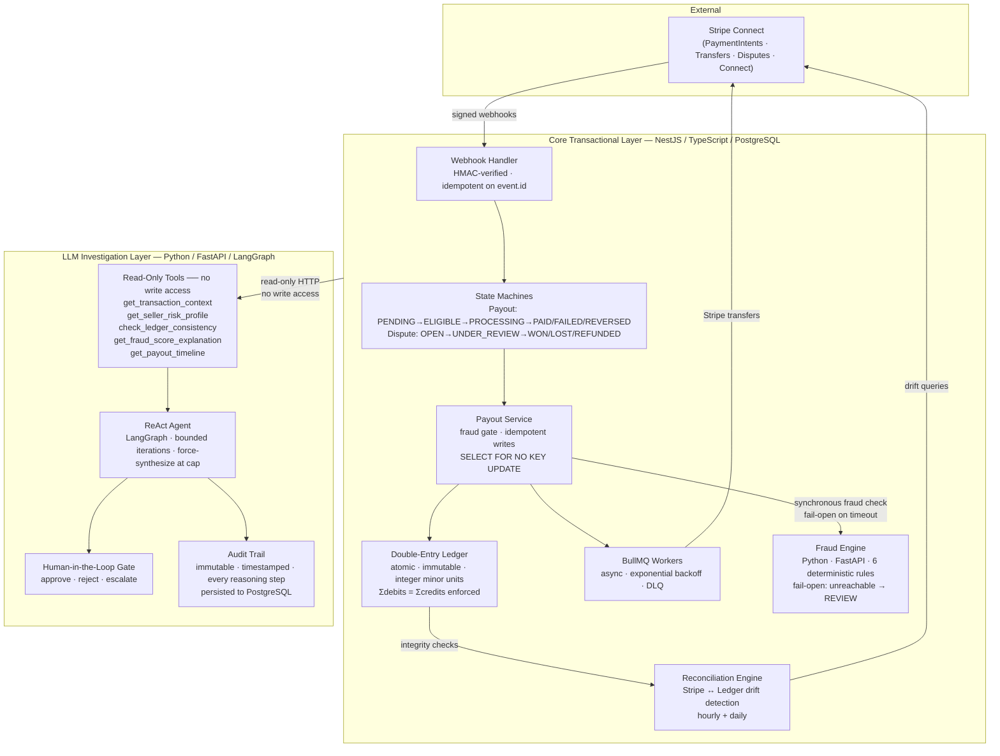

# Distributed Systems Reliability Patterns Applied to LLM Agent Infrastructure

**Production-discipline reference implementation** — double-entry ledger, idempotent write paths, `SELECT FOR NO KEY UPDATE` concurrency, state machine enforcement, reconciliation drift detection, and a LangGraph ReAct agent treated as an untrusted external subsystem with a hard read-only tool boundary, bounded iteration, and audit-grade logging.

**Stack:** NestJS · TypeScript · PostgreSQL · Prisma · Redis · BullMQ · Python · FastAPI · LangGraph  
**Domain:** Stripe Connect marketplace payments — chosen because money gives unambiguous correctness signals (debits must equal credits, state transitions are enumerable, Stripe gives an objective reconciliation target).

---

## Why This Exists

Most LLM agent demos skip the hard parts: what happens when the model loops indefinitely, a tool returns a 503, or synthesis produces malformed JSON? This project applies the same reliability discipline you'd use for any untrusted external dependency — because that's exactly what an LLM is.

**The patterns demonstrated here apply to any agent infrastructure, independent of domain:**

- **Bounded iteration** — the ReAct loop has a hard cap (default: 8). The graph force-synthesizes at the cap rather than running forever. Token spend is bounded by design, not by hope.
- **Fail-open, not fail-silent** — if the fraud engine (or any downstream service) is unreachable, the system routes to `REVIEW`, not `BLOCK` or silent `ALLOW`. Humans stay in the loop. The same principle applies to the agent: unparseable synthesis output produces an `INCONCLUSIVE` verdict, never an unhandled exception.
- **Audit-grade logging** — every LLM reasoning step, tool invocation result, and final verdict is appended to an immutable audit trail with ISO 8601 timestamps. The trail is persisted to PostgreSQL. Investigations are reproducible.
- **Read-only agent boundary** — the LangGraph agent has zero write access to the ledger or payout state. It observes and recommends; a human-in-the-loop gate approves. Enforced structurally: the tool registry contains no mutation endpoints.
- **Idempotent write paths throughout** — from payment intake to payout settlement to reconciliation, every mutation that can be retried is safe to retry. This is the same discipline that makes the agent's tool calls safe to re-invoke after a transient failure.

The fintech domain was chosen specifically because it has ground truth: debits must equal credits, state transitions are enumerable, and reconciliation against Stripe gives an objective correctness signal. These properties make it possible to write deterministic tests for inherently nondeterministic agent behavior — without an LLM API key in CI.

---

## Architecture



---

## Distributed Systems Patterns

### Idempotent Write Paths

Payment intake is idempotent via Redis-cached `idempotencyKey` (24h TTL). The `stripePaymentIntentId` carries a DB-level `@unique` constraint — concurrent requests sharing the same key commit exactly one `Transaction` row; the rest receive a unique-constraint rejection rather than a duplicate write. This holds across multiple Node processes and survives Redis downtime: the DB constraint is the authoritative guard, Redis is a latency optimization.

Payout settlement uses the same discipline: ledger entries are written only after the Stripe transfer succeeds, inside a single `prisma.$transaction()` with the payout status update. A Stripe failure leaves the ledger untouched; a ledger failure rolls back the status update.

### TOCTOU Race Elimination (`SELECT FOR NO KEY UPDATE`)

The original balance check ran outside `prisma.$transaction()`, opening a classic TOCTOU window. With 20 concurrent debits against a 500-cent escrow: each read the same pre-committed balance, each passed the guard, final ledger balance reached −1,400 cents.

The fix moves the balance check inside the transaction and acquires a `SELECT ... FOR NO KEY UPDATE` row lock on each debited account, sorted by ascending `id` to enforce a consistent lock-acquisition order and prevent deadlocks.

`FOR NO KEY UPDATE` (not `FOR UPDATE`) is intentional: `FOR UPDATE` conflicts with the `FOR KEY SHARE` lock PostgreSQL takes on referenced `Account` rows during FK validation of concurrent `Entry` inserts, causing deadlocks under load. `FOR NO KEY UPDATE` serialises competing balance checks while remaining compatible with FK key-share locks.

PostgreSQL forbids locking clauses with `GROUP BY`, so lock acquisition and balance aggregation are two sequential queries inside the same transaction — lock first, then aggregate.

Validated by `ledger.concurrency.spec.ts`: 20 parallel debits against a 500-cent escrow → exactly 5 succeed, 15 rejected with `Insufficient funds`, final balance exactly 0, global ledger balanced.

### State Machine Enforcement

Both payout and dispute lifecycles use explicit transition tables enforced by `validateTransition()`. Invalid transitions return 400. There are no implicit state changes anywhere in the codebase — every status update goes through the validator.

```
Payout:  PENDING → ELIGIBLE → PROCESSING → PAID
                                    └──────→ FAILED → PROCESSING (retry, max 3)
                                    └──────→ REVERSED

Dispute: OPEN → UNDER_REVIEW → WON
                           ├──→ LOST
                           └──→ REFUNDED
```

Opening a dispute auto-freezes any `PENDING` or `ELIGIBLE` payouts on the affected transaction — the freeze is a side effect of the transition, not a separate call site.

### Fail-Open Integration (External Services as Untrusted Subsystems)

The Python fraud engine is treated as an untrusted external dependency with an explicit failure mode contract:

- **Unreachable / timeout** → route to `REVIEW`, not `BLOCK` (which would stop legitimate payouts) and not `ALLOW` (which defeats fraud detection)
- **`REVIEW` gate** → payout holds until a human explicitly releases or rejects it

This same fail-open principle applies everywhere an external subsystem is in the critical path:

- Webhook arrives before payment intent exists → log and skip; reconciliation catches it
- Stripe transfer fails → payout → `FAILED`, ledger untouched; BullMQ retries with exponential backoff
- LLM synthesis produces malformed JSON → `INCONCLUSIVE` verdict, confidence 0.1, raw response in audit trail; never an unhandled exception

### Reconciliation Drift Detection

Hourly (24h window) and daily (all-time) reconciliation jobs compare internal payout state, ledger entries, and Stripe transfer records. The engine classifies drift into distinct categories:

| Drift class | Description |
|-------------|-------------|
| Amount mismatch | Internal payout amount ≠ Stripe transfer amount |
| Orphaned transfer | Transfer in Stripe, no matching payout row |
| Reversed transfer | Transfer reversed in Stripe, ledger not updated |
| Ledger imbalance | Three independent SQL checks: global Σdebits/Σcredits, per-transaction balance, orphaned entry scan |

No auto-fix for ledger imbalances — the ledger is append-only. Corrections are reversal entries, never updates.

---

## LLM Agent Layer

### Graph Topology

```
start → collect → reason ⇄ tool_executor → synthesize → audit → END
```

The `collect` node is deterministic — it always fetches transaction context, seller risk profile, and payout timeline in parallel before the LLM sees any input. This front-loads I/O, reduces required tool calls during reasoning, and bounds the blast radius of hallucinated tool arguments on the first turn.

The `reason ⇄ tool_executor` loop is the ReAct pattern. The conditional edge after `reason` routes on three signals:

1. LLM returned tool calls → execute them, loop back
2. LLM response contains `INVESTIGATION_COMPLETE` → go to `synthesize`
3. `iteration >= MAX_ITERATIONS` → force `synthesize` regardless of LLM output

### Read-Only Tool Boundary

All five agent tools are read-only HTTP calls. The agent cannot mutate payout state, ledger entries, or dispute records. Enforced structurally — the tool registry contains no write endpoints.

| Tool | Endpoint | Reads |
|------|----------|-------|
| `get_transaction_context` | `GET /investigate/transaction/:id` | Transaction, payouts, ledger entries, disputes |
| `get_seller_risk_profile` | `GET /admin/sellers/:id/risk-profile` | Account age, velocity, dispute rate, balance |
| `get_payout_timeline` | `GET /admin/sellers/:id/payout-timeline` | Chronological payouts with trend analysis |
| `check_ledger_consistency` | `GET /ledger/integrity` + `GET /ledger/balance/:id` | Global balance, per-account balance |
| `get_fraud_score_explanation` | `POST /check/explain` | Rule-by-rule fraud score breakdown |

Tools never raise exceptions into the graph. Every HTTP error (4xx, 5xx, connection failure) is caught and returned as a typed error dict `{ error: true, status_code, detail }`. The agent can reason about tool failures as evidence.

### Audit Trail

Every node appends a timestamped entry to `audit_trail` in the graph state:

```
investigation_started → context_collected → llm_reasoning (×N) → verdict_produced → investigation_complete
```

The full trail, verdict JSON, and iteration count are persisted to `InvestigationRun` (PostgreSQL). Audit entries are monotonically ordered — the E2E test suite asserts this property.

### Testing Without an LLM Key

The E2E suite (`tests/test_agent_e2e.py`) mocks the LLM with scripted tool-calling sequences. The mock returns a deterministic sequence: `tool_call → INVESTIGATION_COMPLETE → JSON verdict`. Everything else is real: graph routing, tool HTTP calls to a live NestJS server, PostgreSQL seed/teardown, httpx connections, audit trail ordering. CI runs without an OpenAI key.

---

## System Invariants

Enforced at runtime:

| Invariant | Enforcement | Failure mode |
|-----------|-------------|--------------|
| Σdebits = Σcredits globally | `verifyIntegrity()` SQL; `assertLedgerBalanced()` in every integration test | Reconciliation alert |
| Per-transaction entries balance | `createTransaction()` validates before write | Throws, no write |
| Ledger entries are immutable | No `UPDATE` on `Entry`; corrections via reversal entries | Schema + code |
| All financial writes atomic | `prisma.$transaction()` wrapping every ledger + state change | Atomic rollback |
| Idempotent payment creation | Redis (24h TTL) + DB `@unique` on `stripePaymentIntentId` | Cached result / unique-constraint rejection |
| Payout transitions validated | `validateTransition()` checks allowed-transitions map | 400 Bad Request |
| Concurrent overspend impossible | `SELECT FOR NO KEY UPDATE` inside `$transaction`, ascending id lock order | `Insufficient funds` error |
| Fee split sums to original amount | `calculateFee()` invariant assertion | Throws |
| Negative seller balance auto-blocks | `updateSellerNegativeBalance()` after dispute reversal | `payoutsBlocked = true` |
| Agent cannot write to ledger | Tool registry contains read-only endpoints only | Structural enforcement |

---

## Failure Modes & Recovery

| Scenario | What happens | Recovery |
|----------|-------------|----------|
| Stripe transfer fails | Payout → `FAILED`, ledger untouched | BullMQ auto-retry (max 3, exponential backoff) or manual `forceRetry` |
| Fraud engine unreachable | Fail-open → payout scored `REVIEW` (0.5) | Manual release when engine recovers |
| LLM synthesis malformed | Graph returns `INCONCLUSIVE`, confidence 0.1 | Human review; raw response in audit trail |
| Webhook before payment intent | Transaction lookup null → skip | Reconciliation catches it |
| Duplicate webhook | Transaction already `COMPLETED` | Idempotent no-op |
| Dispute on paid payout | Reversal entries posted; seller may go negative → `payoutsBlocked = true` | Seller must settle; admin unblock |
| Dispute on unpaid payout | Payout frozen at `PENDING/ELIGIBLE` | Unfreezes on `WON`; cancelled on `LOST/REFUNDED` |
| Ledger imbalance detected | `verifyIntegrity()` returns failing transactions | Manual investigation; no auto-fix (immutable ledger) |
| Orphaned Stripe transfer | In Stripe, no matching payout row | Reconciliation flags for manual review |
| Redis down | Idempotency cache miss | Payments still process; DB unique-constraint still holds |
| Agent hits iteration cap | `synthesize` forced at `MAX_ITERATIONS` | Graph always produces a verdict; `INCONCLUSIVE` if evidence thin |

---

## Test Coverage

**92 tests — all pass. `tsc --noEmit` clean.**

### Integration Tests (NestJS)

Real PostgreSQL, mocked Stripe SDK, mocked fraud engine. Every test asserts `assertLedgerBalanced()` after execution.

| Scenario | Verifies |
|----------|---------|
| Happy path: payment → payout → paid | Full money flow, ledger balances, Stripe transfer |
| Duplicate webhook idempotency | Same webhook twice → single state change |
| Fraud gate: ALLOW / REVIEW / BLOCK | All three decision paths |
| Fraud engine down (fail-open) | Timeout → `REVIEW`, not `BLOCK` |
| Stripe transfer failure | Transfer throws → payout `FAILED`, ledger untouched |
| Dispute: WON / LOST / REFUNDED | All resolution paths + ledger reversal |
| Post-payout reversal (negative balance) | `payoutsBlocked = true` enforced |
| Payment idempotency | Same key → cached result |

### Concurrency Tests (`ledger.concurrency.spec.ts`)

Real PostgreSQL, 50 parallel operations, no mocks.

| Scenario | Proves |
|----------|-------|
| 50 parallel credits | Σdebits = Σcredits, no dropped writes, no double-counts |
| 30 parallel mixed debits/credits | No balance drift under contention |
| 20 concurrent debits, 500-cent escrow | Exactly 5 succeed, 15 → `Insufficient funds`, final balance = 0 |
| 15 parallel calls, shared idempotency key | Exactly 1 commit, 14 unique-constraint rejections |

### Agent E2E Tests (`tests/test_agent_e2e.py`)

Real NestJS server, real PostgreSQL, mocked LLM. 15 tests.

| Class | Verifies |
|-------|---------|
| `TestAgentE2ECollectNode` | `collect_node` fetches real data, populates messages, records audit entry |
| `TestAgentE2EToolsLive` | All 5 tools against live NestJS; 404 propagation; error dict shape |
| `TestAgentE2EFullGraph` | Full graph traversal; iteration cap; 404 graceful handling |
| `TestAgentE2EAuditTrail` | Chronological ordering; `transaction_id` in final entry |

### Unit Tests

| Suite | Count | Focus |
|-------|-------|-------|
| Payout state machine | 10 | Valid/invalid transition enforcement |
| Dispute state machine | 9 | Valid/invalid transition enforcement |
| Ledger service | 8 | Balance calculation, fee split, reversal, insufficient funds |
| Fee calculation | 7 | Float edge cases, invariant enforcement |
| Fraud engine rules (Python — pytest) | 16 | Individual rules, scoring thresholds, API contract |

---

## Modules

| Module | Path | Purpose |
|--------|------|---------|
| Ledger | `src/ledger/` | Double-entry bookkeeping, balance queries, integrity checks, concurrency |
| Payment | `src/payment/` | Stripe PaymentIntent creation, idempotent intake |
| Payout | `src/payout/` | Full payout lifecycle, fraud gate, Stripe transfers, retry |
| Fraud | `src/fraud/` | HTTP client to Python fraud engine, fail-open fallback |
| Dispute | `src/dispute/` | Chargeback handling, payout freeze/reverse/refund |
| Seller | `src/seller/` | Stripe Connect onboarding, KYC sync |
| Webhook | `src/webhook/` | Stripe event processing (signed, idempotent on event.id) |
| Queue | `src/queue/` | BullMQ async payout processing, daily cron, DLQ visibility |
| Reconciliation | `src/reconciliation/` | Stripe ↔ ledger ↔ DB sync, drift classification |
| Admin | `src/admin/` | Seller risk profiles, payout timelines, force-retry, reversal |
| Investigation | `src/investigation/` | Per-transaction and per-payout investigation reports |
| Agent | `fraud-engine/agent/` | LangGraph ReAct agent, read-only tools, audit persistence |

---

## Quick Start

### Prerequisites

- Node.js 20+
- Docker & Docker Compose

### Local Development

```bash
# Start infrastructure (PostgreSQL + Redis)
npm run docker:dev

# Configure environment
cp .env.example .env
# Edit .env with your Stripe keys

# Install, generate, migrate, seed
npm install
npx prisma generate
npx prisma migrate deploy
npx prisma db seed

# Start dev server
npm run start:dev
```

Swagger: http://localhost:3000/api

### Fraud Engine

```bash
cd fraud-engine
python -m venv venv && source venv/bin/activate
pip install -r requirements.txt
uvicorn app.main:app --reload --port 8000
```

### Run Tests

```bash
# NestJS (requires Docker running for PostgreSQL + Redis)
npm test

# Fraud engine
cd fraud-engine && pytest tests/ -v
```

### CI Pipeline

GitHub Actions runs: `tsc --noEmit` → Jest (with PostgreSQL + Redis service containers) → Docker build validation.

---

## Environment Variables

See `.env.example`. Key variables:

| Variable | Purpose |
|----------|---------|
| `DATABASE_URL` | PostgreSQL connection string |
| `REDIS_URL` | Redis connection (production) |
| `REDIS_HOST` / `REDIS_PORT` | Redis connection (local dev) |
| `STRIPE_SECRET_KEY` | Stripe API key |
| `STRIPE_WEBHOOK_SECRET` | Webhook signature verification |
| `FRAUD_ENGINE_URL` | Python fraud service (default: `http://localhost:8000`) |

---

## Production Notes

Intentional omissions:

- **Auth/RBAC** — Solved problem. Complexity budget spent on financial correctness, concurrency, and agent reliability.
- **UUIDs for public IDs** — Autoincrement used for development speed. Migration is straightforward.
- **NestJS ConfigModule** — `process.env` used directly. ConfigModule adds ceremony without improving correctness at this scope.
- **LLM provider abstraction** — Agent uses OpenAI via LangChain. Swapping providers is a one-line config change (`AGENT_LLM_MODEL`); graph and tools are provider-agnostic.
