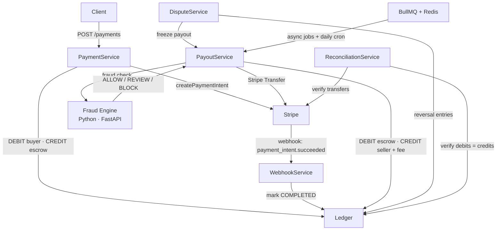

# Payment Processing System

Full-cycle marketplace payment backend — escrow holding, fraud-gated seller payouts, dispute resolution, and double-entry ledger integrity checks.

**Production:** https://payment-processing-system-production.up.railway.app &nbsp;·&nbsp; [Swagger](https://payment-processing-system-production.up.railway.app/api)

---

## Architecture



**Tech stack:** NestJS · TypeScript · PostgreSQL · Prisma · Redis · BullMQ · Python · FastAPI · Docker · GitHub Actions

---

## What This Handles

- **Stripe transfer failure mid-payout** — payout marked FAILED, escrow funds preserved; no partial ledger writes because ledger entries are booked only after a successful transfer.
- **Fraud engine unavailable** — fail-open to REVIEW; payouts are never blocked by an outage, just flagged for manual review.
- **Duplicate webhook delivery** — idempotent by design; Redis-cached idempotency key (24h TTL) prevents double-booking on replayed Stripe events.
- **Dispute after payout released** — payout reversed via mirror ledger entries; if seller already withdrew, balance goes negative and payouts are auto-blocked until resolved.
- **Ledger drift detection** — `verifyIntegrity()` runs three SQL aggregate checks (global balance, per-transaction balance, orphaned entries) and returns a typed report; wired into the reconciliation scheduler.

---

## Quick Start

```bash
# 1. Start infrastructure (PostgreSQL + Redis)
npm run docker:dev

# 2. Configure environment
cp .env.example .env   # add your Stripe test keys

# 3. Install and migrate
npm install
npm run prisma:generate
npm run prisma:migrate
npm run prisma:seed

# 4. Run
npm run start:dev
```

Swagger: http://localhost:3000/api

---

## API Endpoints

| Method | Path | Description |
|--------|------|-------------|
| `GET` | `/health` | Health check (DB + Redis) |
| `POST` | `/payments` | Create payment (Stripe PaymentIntent + escrow entry) |
| `POST` | `/webhooks/stripe` | Stripe webhook handler |
| `POST` | `/payouts/create` | Create PENDING payout |
| `POST` | `/payouts/:id/mark-eligible` | Fraud check gate → ELIGIBLE |
| `POST` | `/payouts/:id/process` | Stripe Transfer → PAID/FAILED |
| `POST` | `/payouts/:id/retry` | Retry failed payout |
| `GET` | `/payouts/status/:status` | List payouts by status |
| `POST` | `/disputes/open` | Open dispute (freezes payouts) |
| `POST` | `/disputes/:id/review` | Mark UNDER_REVIEW |
| `POST` | `/disputes/:id/resolve` | Resolve won/lost/refund |
| `GET` | `/disputes/status/:status` | List disputes by status |
| `POST` | `/sellers/register` | Register seller + Stripe Connect account |
| `GET` | `/sellers/:id/onboarding-link` | Generate Stripe KYC URL |
| `POST` | `/queue/payout` | Enqueue async payout job |
| `GET` | `/queue/jobs` | Bull Board queue admin UI |
| `GET` | `/ledger/accounts` | All accounts with balances |
| `GET` | `/ledger/balance/:id` | Account balance |
| `GET` | `/ledger/transactions/:id` | Account transaction history |
| `GET` | `/ledger/integrity` | Ledger integrity report |
| `POST` | `/reconciliation/recent` | Reconcile recent transactions (24h) |
| `POST` | `/reconciliation/all` | Deep reconciliation (all-time) |
| `POST` | `/reconciliation/payouts` | Reconcile payouts against Stripe |
| `POST` | `/reconciliation/ledger` | Verify ledger debit = credit |

---

## Project Structure

| Module | Path | Purpose |
|--------|------|---------|
| Ledger | `src/ledger/` | Double-entry bookkeeping engine |
| Payment | `src/payment/` | Stripe PaymentIntent + escrow entry |
| Payout | `src/payout/` | Full payout lifecycle + retry logic |
| Fraud | `src/fraud/` | HTTP client to Python fraud engine |
| Dispute | `src/dispute/` | Chargeback handling + ledger reversal |
| Seller | `src/seller/` | Stripe Connect KYC + account management |
| Webhook | `src/webhook/` | Stripe event processing |
| Queue | `src/queue/` | BullMQ async payout processing |
| Reconciliation | `src/reconciliation/` | Stripe/ledger sync + integrity checks |
| Fraud Engine | `fraud-engine/` | Python/FastAPI microservice, 6 fraud rules |
